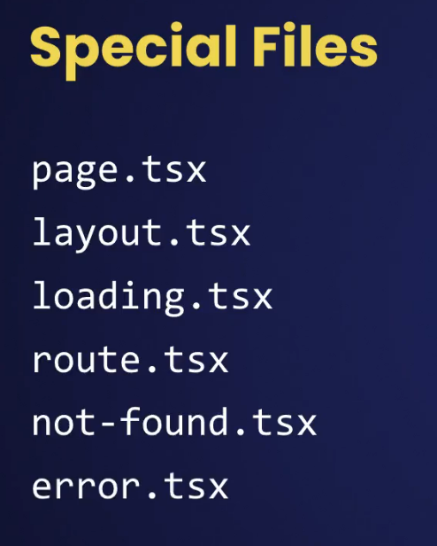

# 3. Routing and Navigation

## Routing Overview

In Next.js, there is a built-in router that is based on the file system.

To make a route publicly accessible, we need to use `a page` file inside that folder. `layout` files are used to define a common layout for the pages.

## Dynamic Routes

- params in dynamic routes (like `[id]`) is now **asynchronous** in Next.js 15 and later.

- So, instead of accessing params.id synchronously inside your component, you now have to await it — because params is provided as a Promise

## Catch-all Segments

- `[...slug]` - This requires **at least one** segment in the URL. (Example: `/docs/a `or `/docs/a/b`)

- `[[...slug]]` - This makes the catch-all segment **optional**. (Example: `/docs`, `/docs/a`, or `/docs/a/b`)

## Accessing qurt parameters.

To access **route parameters**, we use the `params` keyword. To access **query parameters**, we use the `searchParams` keyword. This is the rule in Next.js, and starting from **Next.js 15**, both of these are **asynchronous**.

Note - We can access `params` or `searchParams` only inside **page files**. They cannot be accessed directly inside **components**.

## Layouts

We use layouts to create UI that is shared across multiple pages.

A layout component should have a `children` prop of type `ReactNode`.

## Navigation

## Programatic Navigation

For programmatic navigation, we use `useRouter` from **next/navigation**. (`useRouter` from **next/router** is used with the Page Router and does not work with the App Router.)

## Showing Loading UIs

Using **Suspense**, we can show a fallback UI until the component finishes loading.

If we want to add suspense to every page, we can do it in two ways:

1. Go to the root layout and wrap the `children` React node with **Suspense**.
2. Add a `loading.tsx` file to the root layout.

## Handling Not Found Errors

Using a `not-found.tsx` file, we can create a "Not Found" page for a root layout or inside each folder.

In **Next.js App Router**, the `notFound()` function from `next/navigation` can be used to programmatically trigger the "Not Found" page.

## Handling Unexpected Errors

Using an `error.tsx` file, we can create an error page for the root level or any part of the application (inside any folder).

If we create an `error.tsx` file at the root level, it **cannot catch errors** that occur in layout.tsx in root layout (for example, if there is some logic in layout.tsx). To catch those, we should create a separate file called `global-error.tsx`.

The `error.tsx` file should be a **client component**, because it allows users to retry the action. This retry functionality is provided by Next.js, so the client can click a button to attempt the action again. Use this only in necessary parts, otherwise users may trigger it too many times.

**Extra**: We can log the errors when they are caught. One of the most popular services for this is **Sentry**.

# 4. Building APIs

## Getting a Collection of Objects

In a given folder or URL segment, we can have **either a page file or a route file,** but not both. If we need to **display something to the user or return markup**, we should use a **page file**. If we need to handle HTTP requests, we should use a **route** file.

In route files, we can create one or more route handlers. A route handler processes HTTP requests.

**Extra**: When we include the request object in parameter, Next.js will not cache the data. If we remove it, Next.js will cache the data, so the next time it hits the endpoint, it will serve the cached data.
