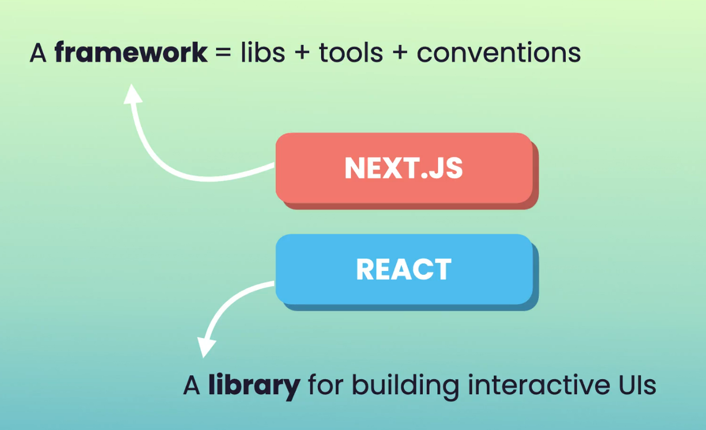
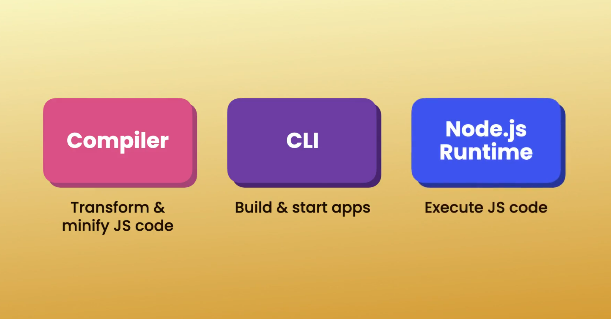
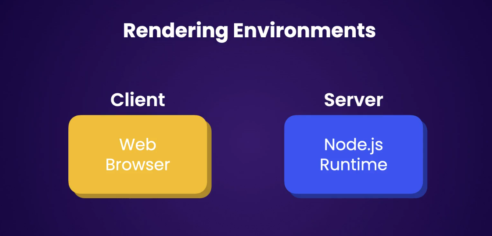
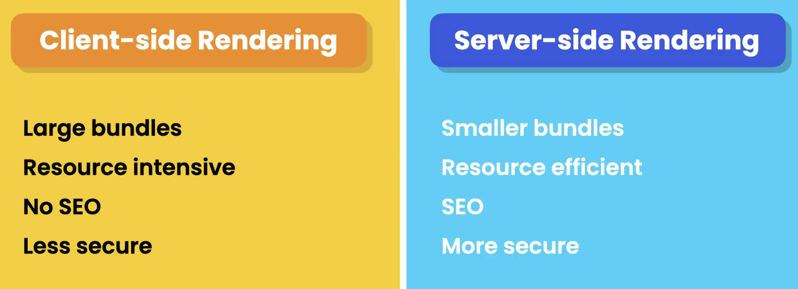
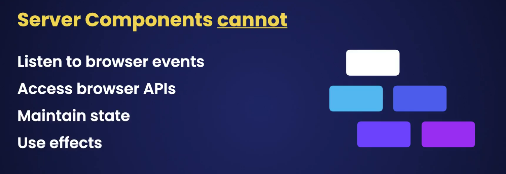

# 1. Next js Fundamentals

## What is Next Js ?

Next.js is a framework for building fast and search-engine-friendly applications.

Next.js comes with a

Since Next.js has the Node.js runtime, we can do full-stack development (can write both frontend and backend code within the same Next.js project).

The backend code executes in the Node.js runtime, and the frontend code gets bundled and sent to the client for execution within a web browser.

The Node.js runtime allows us to render our components on the server and send their content to the client. This is called server-side rendering (SSR) and can make our apps faster and more search-engine-friendly.

With Next.js, we can pre-render certain pages and components that have static data when we build our application. We just render them once and serve them whenever they are needed. This is called static site generation and makes our application faster.

## Creating your First NextJs Project

`npx create-next-app@latest`

## Routing and Navigation

Routing in Next.js is based on the file system — meaning it follows convention over configuration.

The difference between the **App Router** and the **Pages Router** is that in the **Pages Router**, if we place any files inside a folder (for example, the `users` folder), those files can be accessed publicly.

For instance: - `localhost:3000/users/test.cs`s would be publicly accessible.

However, in the **App Router**, this is **not possible** — only files specifically meant to be routed (like `page.tsx`) are exposed, making it more secure and organized.

---

For navigation, we use the `Link` component provided by `next/link`. This only re-renders the **relevant part of the page** instead of reloading the entire page. This process is called **client-side navigation**, because unlike a normal `<a>` tag (which reloads the entire page including fonts, icons, and scripts), the `Link` component updates only the necessary parts, making navigation much faster.

## Client and Server Components

In Next.js projects, we have two environments where we can render our components and generate HTML markup: either in the **client** (web browser) or on the **server** (within the Node.js runtime).

Rendering a component in the **client** is similar to how React normally works. We refer to this technique as **Client-Side Rendering (CSR).**

In contrast, we have** Server-Side Rendering (SSR)**, where the components are rendered on the server.

There are benefits to server-side rendering, such as faster initial load and better SEO. However, with server-side rendering, we lose interactivity.

Server components **cannot** listen to browser events like `click`, `change`, `submit`, etc. They also **cannot** access browser APIs like `localStorage` or maintain state using hooks like `useState` or `useEffect`. These functionalities are only available in **Client Components.**

---

### Best Practices

In real-world applications, we often use a **mixture of server and client** components.

- We should default to server components.
- Use client components only when we absolutely need interactivity or browser-specific features.

In Next.js, all components in the `app/` folder are server components by default.

---

### Client-Side vs Server-Side Rendering Example

- In **Server Components**, we can see the HTML document we get from the backend. This is exactly what search engines see when they crawl our website.

- In **Client-Side Rendering**, search engine bots may not see the content immediately because all content is rendered in the browser, which can result in an empty or blank page for SEO purposes.

**Note**: The _Pages Router_ doesn’t support server components — only the App Router supports server components.
