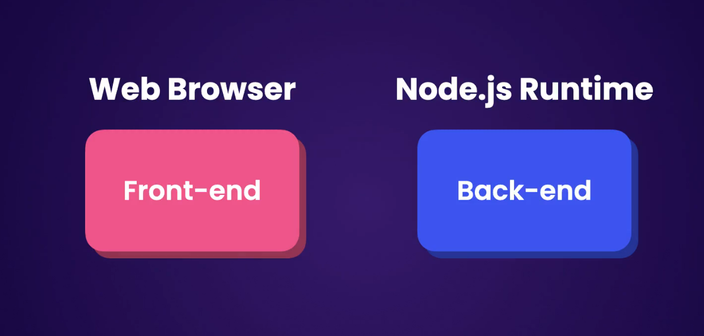

# 1. Next js Fundamentals

## What is Next Js ?

Next.js is a framework for building fast and search-engine-friendly applications.

Next.js comes with a

Since Next.js has the Node.js runtime, we can do full-stack development (can write both frontend and backend code within the same Next.js project).

The backend code executes in the Node.js runtime, and the frontend code gets bundled and sent to the client for execution within a web browser.

The Node.js runtime allows us to render our components on the server and send their content to the client. This is called server-side rendering (SSR) and can make our apps faster and more search-engine-friendly.

With Next.js, we can pre-render certain pages and components that have static data when we build our application. We just render them once and serve them whenever they are needed. This is called static site generation and makes our application faster.

## Creating your First NextJs Project

npx create-next-app@latest
