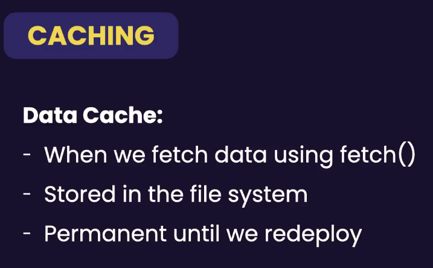
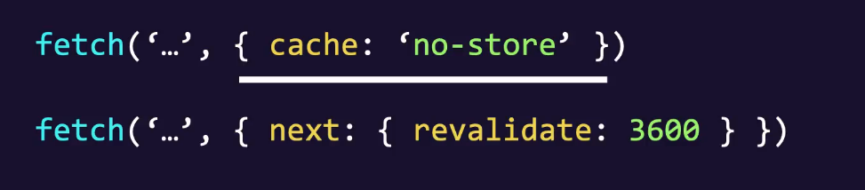
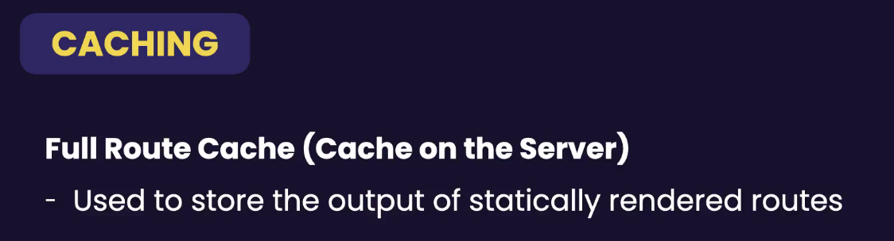
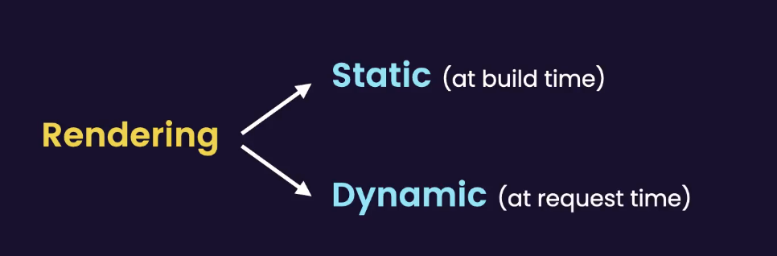
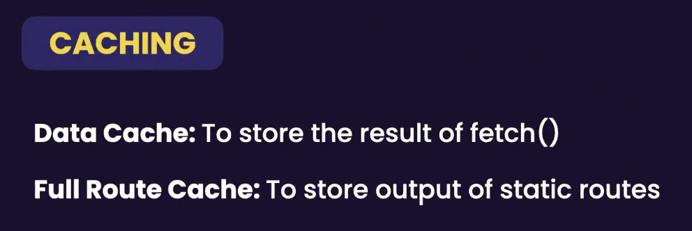
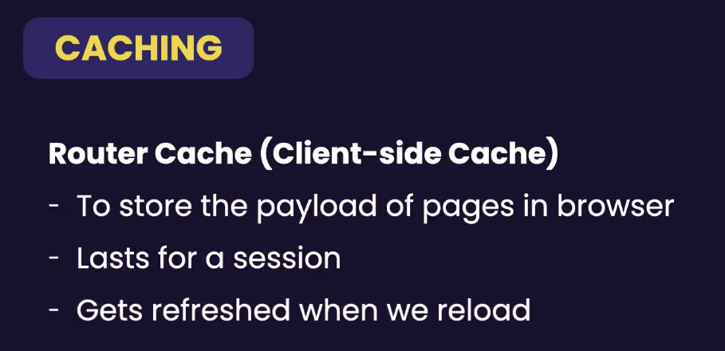

# 1. Setting Up the Project

## Styling the Active Link

In NextJs, We can only access **Browser APIs** on the client side because features like _window, document, localStorage, navigator, location, Notification, and Clipboard_ exist only in the browser and not on the server.

We can use a popular package called **classnames** to render classes based on conditions, which is especially useful for long Tailwind classes.

# 2. Updating Issue

## Understanding the Caching

NextJS has 3 types of caching.

Both above are exist on the server.

